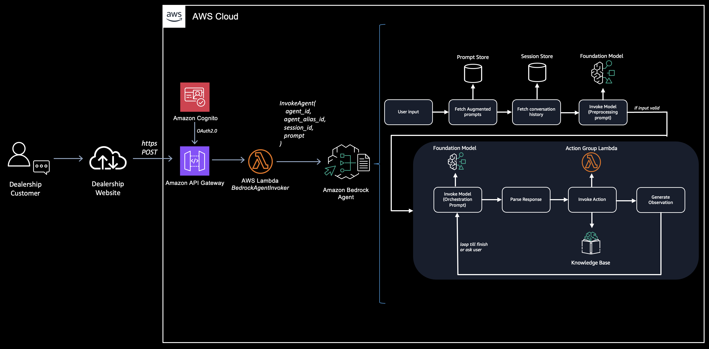
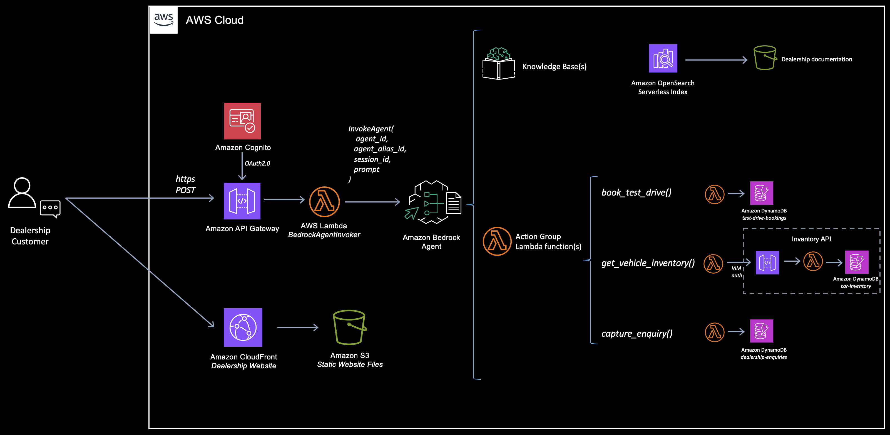
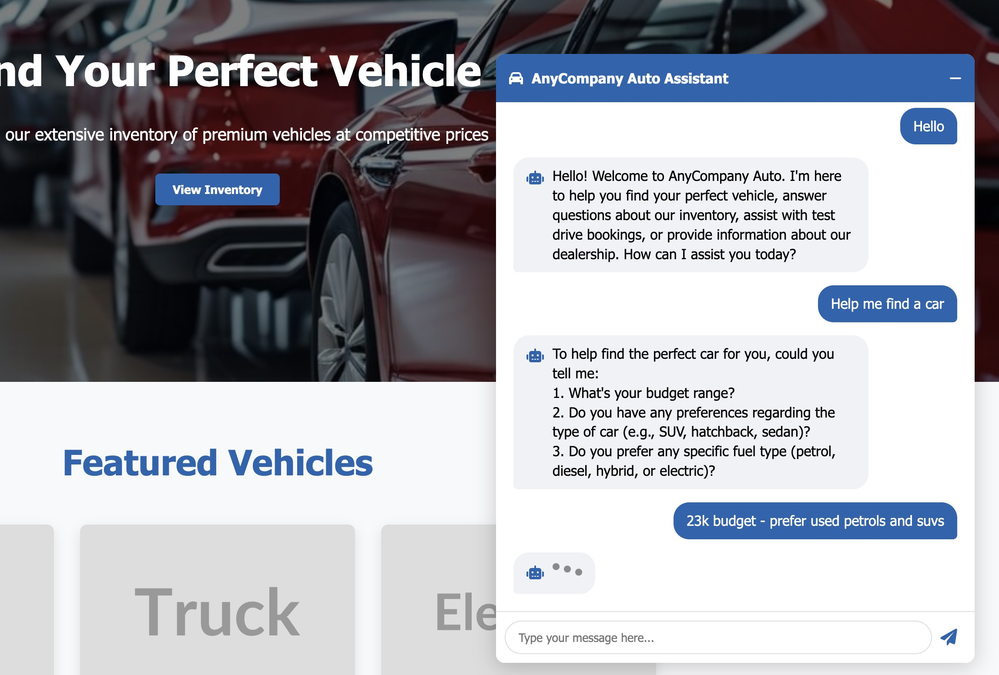

# Amazon Bedrock Agents Sample - Car Dealership Website AI Assistant

A sample AI assistant for a car dealership website using [Amazon Bedrock Agents](https://aws.amazon.com/bedrock/agents/). The agentic solution is designed to help customers:
* Find their perfect vehicle using a real-time stock inventory API
* Answer questions about the dealership using a knowledge base
* Capture customer enquiries for humman follow-up
* Book vehicle test drives

The project features a basic car dealership web user interface to simulate the real world use case.

The sample code is written using the [AWS Cloud Development Kit (CDK)](https://aws.amazon.com/cdk/) in Python. 

## Components

*  **Dealership Website UI**
    * Simple HTML, CSS and JavaScript code hosted in [Amazon S3](https://aws.amazon.com/s3/) and fronted by [Amazon CloudFront](https://aws.amazon.com/cloudfront/).
*  **Vehicle Inventory API**
    * Vehicle stock and specification data hosted in [Amazon DynamoDB](https://aws.amazon.com/dynamodb/) with [Amazon API Gateway](https://aws.amazon.com/api-gateway/) and [AWS Lambda](https://aws.amazon.com/lambda/) providing the API. Uses [AWS IAM auth](https://docs.aws.amazon.com/apigateway/latest/developerguide/permissions.html) on the API (M2M).
*  **Amazon Bedrock Agent**
    * [Amazon Bedrock Agent](https://aws.amazon.com/bedrock/agents/) configuration using action groups for test drive bookings, capturing enquiries to DynamoDB and querying the inventory API. AWS Lambda functions provide the action group logic.
*  **Amazon Bedrock Knowledge Base**
    * [Amazon Bedrock Knowledge Base](https://aws.amazon.com/bedrock/knowledge-bases/) containing information about the dealership for the AI assistant agent to use. Uses [Amazon OpenSearch Serverless](https://aws.amazon.com/opensearch-service/features/serverless/) for the vector store and Amazon S3 containing website HTML files as the data source.
*  **Agent Invoker API**
    * REST API to invoke the agent from the website frontend and get a response. Deployed using Amazon API Gateway and AWS Lambda. Uses [Amazon Cognito](https://aws.amazon.com/cognito/) for auth.

## Architecture

*Architecture diagram showing Amazon Bedrock Agent flow*



*Architecture diagram showing knowledge base and actioin group detail*


## Repository Structure
```
.
├── agent_action_schemas/           # OpenAPI schemas for Amazon Bedrock Agent actions
│   ├── book_test_drive.yaml          # Schema for test drive booking endpoints
│   └── query_inventory.yaml          # Schema for inventory query endpoints
├── agent_functions/                # AWS Lambda functions for Bedrock Agent actions
│   ├── book_test_drive.py            # Handles test drive scheduling
│   ├── capture_enquiry.py            # Captures and stores customer enquiries in a database for human follow up
│   ├── get_todays_date.py            # Utility for date operations
│   └── query_inventory.py            # Queries the live vehicle inventory API
├── functions/                      # Core AWS Lambda functions
│   ├── agent_invoker.py              # Handles Amazon Bedrock Agent interactions
│   └── get_vehicle_inventory.py      # Manages vehicle inventory data
│   └── kb_ingestion.py               # Automatically syncs the knowledge base S3 data source when files are updates/added/deleted
├── dealership_ai_cdk/              # AWS CDK infrastructure code
│   └── dealership_ai_cdk_stack.py    # Main infrastructure stack
├── inventory_seed/                 # Initial vehicle inventory data for Amazon DynamoDB
│   ├── inventory.json                # DynamoDB JSON data to populate the databaase - modify as you wish
├── prompts/                        # Agent prompt overrides
│   ├── orchestration.txt             # Overrides the orchestration prompt to format vehicle inventory data
├── website/                        # Frontend web application
│   ├── index.html  
│   ├── script.js       
│   └── styles.css  
│   └── callback.html
│   └── valuations.html
│   └── aboutus.html      
```

## Usage Instructions
### Prerequisites
- Python 3.13 or higher
- AWS CLI configured with appropriate credentials
- Node.js and npm (for CDK deployment)
- AWS CDK CLI installed (`npm install -g aws-cdk`)
- An AWS account with permissions to create required resources
- By default the project uses the `Anthropic Claude 3.5 Sonnet v2` foundation model for the agent. Ensure you are using an [AWS Region that supports this model](https://docs.aws.amazon.com/bedrock/latest/userguide/models-regions.html). If you do not specify a region the CDK code defaults to using `us-west-2 (Oregon)` as the AWS Region.

### Installation

1. Clone the repository:
```bash
git clone https://github.com/aws-samples/sample-bedrock-agent-dealership-ai-assistant.git
cd sample-bedrock-agent-dealership-ai-assistant
```

2. Create and activate a Python virtual environment:
```bash
# Linux/MacOS
python3 -m venv .venv
source .venv/bin/activate

# Windows
python -m venv .venv
.venv\Scripts\activate.bat
```

3. Install dependencies:
```bash
pip install -r requirements.txt
pip install -r requirements-dev.txt
```

4. Enable Amazon Bedrock model access in the region you are using by [following these instructions](https://docs.aws.amazon.com/bedrock/latest/userguide/model-access-modify.html). By default the project requires the following Models:
```
ANTHROPIC_CLAUDE_3_5_SONNET_V2_0
TITAN_EMBED_TEXT_V2_1024
```

5. Deploy the infrastructure:
```bash
cdk deploy
```

### Synchronizing the Knowledge Base S3 data source (first time only)

Once the CDK stack has deployed successfully you will need sync the Amazon Bedrock Knowledge Base data source. This is only required after first deployment. An S3 event trigger has been configured to automatically resync when files are created/removed from the bucket.

Run the following commmand:
```bash
aws bedrock-agent start-ingestion-job --data-source-id <value> --knowledge-base-id <value> --region <value>
```

### Testing

1. Once the CDK deplyment is complete browse to the `DealershipWebsite` output URL. e.g. `https://<distribution-name>.cloudfront.net`

2. Click `Sign In` to signup with an Amazon Cognito user. This needs to use a valid email address for verification purposes.

3. Once sign up is complete, login with your username and password. You will be redirected back to the dealership website.

4. Click `Chat with us` in the bottom right hand corner to test!


## Example prompts

Below are some suggested prompts to get you started. Be sure to test using your own!

At times the AI assistant will prompt for an email address to capture an enquiry. This does not have to be a valid email. The enquiry will be logged to the `dealership-enquiries` DynamoDB table.

```
USER: Help me find a car
```

```
USER: What time is the dealership open tomorrow?
```

```
USER: What is the most economical car you have in stock?
```

```
USER: Can I part-exchange my car?
```

```
USER: I'd like to schedule a test drive for vehicle [x]
```

```
USER: What are the benefits of buying electric?
```



## Cleaning Up
**WARNING:** this project is configured to delete DynamoDB table and S3 bucket data by default. Ensure you save anything you wish to keep before running cdk destroy.

Resources can be deleted by running:
```bash
cdk destroy
```


## Security

See [CONTRIBUTING](CONTRIBUTING.md#security-issue-notifications) for more information.

## License

This library is licensed under the MIT-0 License. See the LICENSE file.

